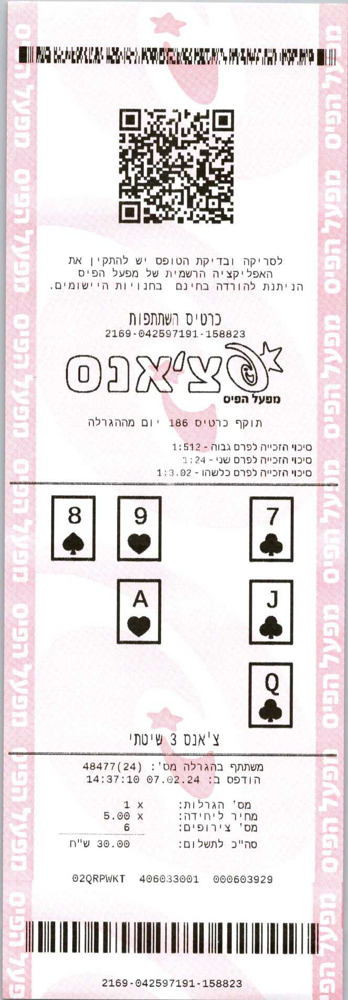

## Check parser
Finding needed data from check image
***


### Setup
```shell
pip install -r requirements.txt
```

### Usage
```python
from parser import ParserChecks
path = "path/to/check_image"
parser = ParserChecks(path)
check_data, all_not_found, not_found_data, check_logs = parser.get_result()  # Will print in console all data

# In check_data will(or you can do "parser.check_info") this structure:
# {
#     "cards": {
#         "clubs": [
#             "7",
#             "J",
#             "Q"
#         ],
#         "diamonds": [],
#         "hearts": [
#             "9",
#             "A"
#         ],
#         "spades": [
#             "8"
#         ]
#     },
#     "dashed_number": "2169042597191158823",
#     "date": "14:37:10 07.02.24",
#     "extra": false,
#     "extra_number": "",
#     "game_id": "4847724",
#     "game_subtype": "chance_systematic",
#     "game_type": "chance",
#     "is_double": false,
#     "is_table_pattern": false,
#     "qr_code_link": "https://www.pais.co.il/qr.aspx?q=eNozNDUwMgACUwNDAwMTCxNzczgFAhbBdZYejh515s5ezoHOdaamFgYADskLlwAAAAA=\n",
#     "spaced_number": "02QRPWKT 405033001 000603929",
#     "spent_on_ticket": 30.0,
#     "table": {}
# }
```

* parser_cabala.py - ParserChecks parser class with many methods
* elements_coords_in_img.py - file with dicts with coords of symbols from templates images 

### Parsing algorithm:
1) Try get QR code, if not - image is not valid - skip it. Rotate img if need(if QR code not at the top)
2) Rotate image by 1-10 degrees if needed and crop sides (if check scanned not straight)
3) Convert image to white and black, save it and create other needed image manipulation
4) Find main lines 777, 123, chance - 2 main lines. Lotto 3 or 4 main lines(Main lines - content lines)
5) Get game type and subtype
6) Find main data contours(main data - game_id, sum, date, spaced and dashed numbers)
7) Get these main data
8) Find table(123, 777, lotto(and extra)) or cards(chance)

## Work Example
***
### Image:


### Response dict:
```shell
{
    "cards": {
        "clubs": [
            "7",
            "J",
            "Q"
        ],
        "diamonds": [],
        "hearts": [
            "9",
            "A"
        ],
        "spades": [
            "8"
        ]
    },
    "dashed_number": "2169042597191158823",
    "date": "14:37:10 07.02.24",
    "extra": false,
    "extra_number": "",
    "game_id": "4847724",
    "game_subtype": "chance_systematic",
    "game_type": "chance",
    "is_double": false,
    "is_table_pattern": false,
    "qr_code_link": "https://www.pais.co.il/qr.aspx?q=eNozNDUwMgACUwNDAwMTCxNzczgFAhbBdZYejh515s5ezoHOdaamFgYADskLlwAAAAA=\n",
    "spaced_number": "02QRPWKT 405033001 000603929",
    "spent_on_ticket": 30.0,
    "table": {}
}

```
